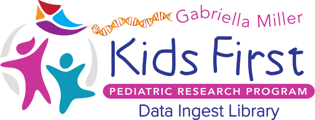

  

  
  
  
  

Kids First Data Ingest Library
================================
The Kids First Data Ingest Library is an ETL (extract, transform, load) library that standardizes the ingestion of raw Kids First study data into target Kids First services. Currently, the only supported target service
is the Kids First Data Service. More may be added later.

A command line interface (CLI) app is included with the library and is the primary user interface for executing the ingest pipeline.

## Documentation
Visit the documentation site to get started:
https://kids-first.github.io/kf-lib-data-ingest/
