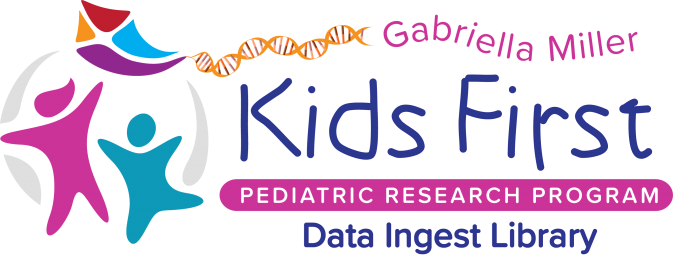
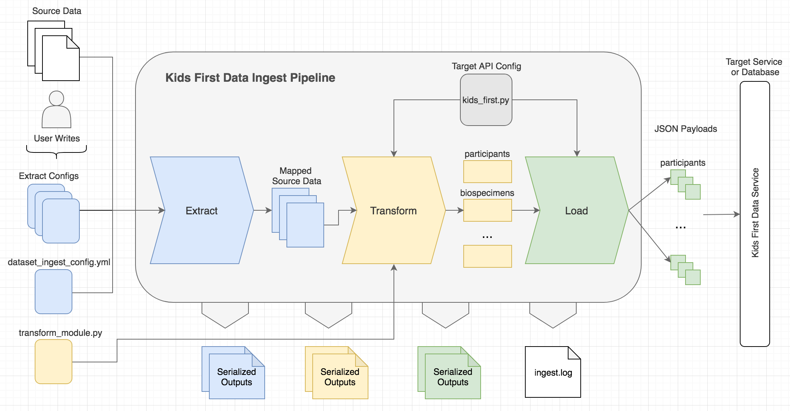

----

Library Code Repository: https://github.com/kids-first/kf-lib-data-ingest

.. toctree::
   :caption: Table of Contents
   :maxdepth: 2

   self
   install
   quickstart
   design/overview.rst
   tutorial/index.rst
   developer
   reference/index.rst
   modules.rst

********
Overview
********

The Kids First Data Ingest Library is both an ETL (extract, transform, load)
framework and a library that standardizes the ingestion of raw Kids First study
data into target Kids First services.

Framework and Library
=====================

Since this is a library as well as a framework, there are components of the
``kf_lib_data_ingest`` package that can be used as standalone tools or
utilities. The ``ExtractStage`` for example can be used as a standalone tool
for data selection and mapping (see :ref:`Tutorial-Extract-Stage` for details).
Anything in ``kf_lib_data_ingest.utilities`` can be used as a standalone tool.

Additionally, there are a handful of helper functions in
``kf_lib_data_ingest.common.pandas_utils`` that could be used outside of the
framework for data wrangling tasks. See <TODO> for details.

Ingest App
==========

The library comes with a built-in command-line-interface-based (CLI) app
which is the primary user interface for executing the ingest pipeline.
Most users will use this app to create new ingest packages, test packages,
and ingest Kids First study datasets into the Kids First Data Service.
The Kids First Data Service is the only supported target service at this point.

Ingest Packages
===============

In order to use this library to ingest a study, users must create an ingest
package which contains all of the necessary configuration defining basic ingest
input parameters and also how to extract and transform data.

Ingest Pipeline
===============

   Overview of the ingest pipeline

Users
-----

Users of the ingest system will likely fall into 2 categories:

1. **Ingest Operator**

   - Will never create a new study ingest package
   - Will likely just be running existing ingest packages
   - May need to learn how to modify configuration by inspection of existing
     ingest package configurations

2. **Ingest Package Developer**

   - Runs ingest packages
   - Understands how to create new ingest packages and modify existing ones
   - Knows Python well and likely knows Pandas fairly well

Inputs
------

- **Local or remote source data files**
- **Configuration files**

Source data files might look like this:

.. csv-table:: data.tsv
    :header: "p id", "gender", "sample id"

    "PID001", "f", "SS001"
    "PID002", "female", "SS002"
    "PID003", "m", "SS003"

Outputs
-------

- **Ingest log** - A log file containing runtime details of an executed ingest
  job
- **Serialized stage output** - The output of each stage execution in a
  serializable form written to disk

Extract Stage
-------------

The extract stage does the following:

1. **Retrieve** - Retrieve the source data files, whether they are local or
   remote, and read them into memory
2. **Select** - Extract the desired subset of data from the source data files
3. **Clean**- Clean the source data (remove trailing whitespaces, etc)
4. **Map** - Map the cleaned data to a set of standard Kids First attributes
   and values

The standard set of attributes and values are defined in the Kids First
Standard Concept Schema. See <TODO> for more details.

Extract stage output might look like this:

.. csv-table:: data.tsv
    :header: "CONCEPT.PARTICIPANT.ID", "CONCEPT.PARTICIPANT.GENDER", "CONCEPT.BIOSPECIMEN.ID"

    "PID001", "Female", "SS001"
    "PID002", "Female", "SS002"
    "PID003", "Male", "SS003"

Transform Stage
---------------

The transform stage converts the clean and standardized data into a form that
closely resembles what is expected by the target database or service.

These are the main steps performed by transform stage:

1. **Merge Extract Stage tables into unified form**

    If in guided transform mode, the Transform Stage will apply the
    user-defined transform function. This function specifies how the individual
    tables from the Extract Stage should be merged into a single table.

2. **Create unique identifiers for concepts**

    For most concepts, the contributor of the data provides their own IDs to
    uniquely identify the concept within a dataset. But for some, such as
    diagnosis and phenotype observation events, an event ID isn't typically
    provided.

    The Transform Stage will create its own unique identifiers and assign one
    to every concept instance. Most unique identifiers just equate to the ID
    provided by the data contributor, while others are created from a
    combination of values (e.g. diagnosis event = participant ID + diagnosis
    name + participant age at event).

3. **Convert from standard form to target form**

    Next, the Transform Stage emits target entity instance dicts.

    Properties in the unified form (standard concept attributes) are converted
    to target concept properties using the Kids First target API configuration
    file.

4. **Apply common cleaning for the target service**

    This includes actions like filling in leftover null or unknown values with
    standard values (Not Reported, Unknown, etc).

Transform stage output might look like this:

.. code-block:: json

    {
        "participant": [
            {
                "endpoint": "/participants",
                "id": "P001",
                "links": {
                    "family_id": "f1",
                    "study_id": null
                },
                "properties": {
                    "affected_status": "Not Reported",
                    "consent_type": "GRU",
                    "ethnicity": "Not Reported",
                    "external_id": "1",
                    "gender": "Female",
                    "is_proband": "True",
                    "race": "Not Reported",
                    "visible": "Not Reported"
                }
            }
        ]
    }

Load Stage
----------

At this point, the data is in a form that is almost ready to be submitted to
the target service. The Load Stage will build the target payloads and either
POST or PATCH them to the target service.

Head to :ref:`how_to` to get started with data ingestion!
