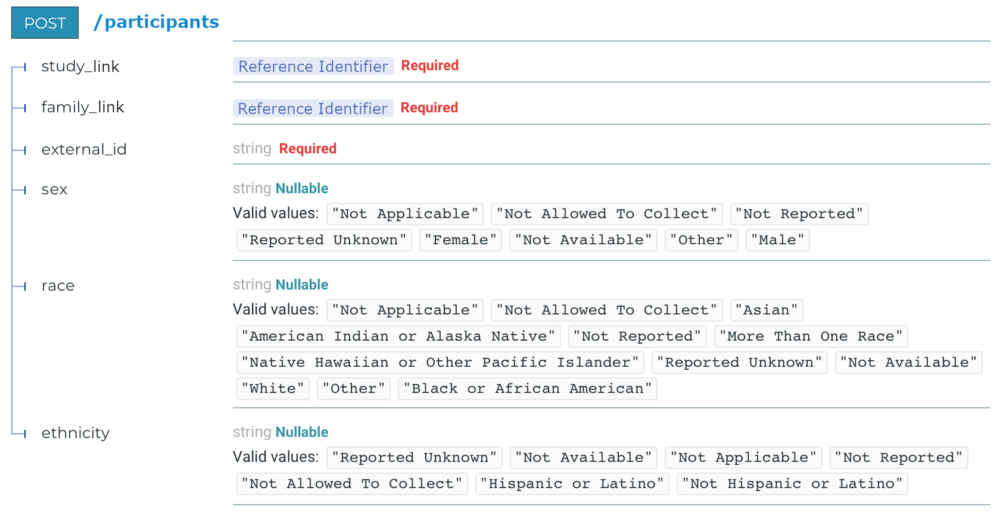

.. _Tutorial-Make-Target-Service-Plugin:

##############################
Making a Target Service Plugin
##############################

You have a bunch of extracted data that has been suitably merged together, and
you have a server with a submission API, and now you want to put that data into
that server. You need a target service plugin module that will convert from
your tabular extracted data into the appropriate form for sending to your
target service and that will negotiate the submission according to the demands
of the service.

Existing Plugins For Reference
==============================

Here are two complete examples that work with the same input data for different
target servers. Seeing what they look like in their entirety may be helpful in
understanding what we're trying to make:

- Plugin for loading data into the Kids First FHIR server:

  https://github.com/kids-first/kf-model-fhir/tree/master/kf_model_fhir/ingest_plugin

- Plugin for loading data into the Kids First non-FHIR Dataservice:

  https://github.com/kids-first/kf-lib-data-ingest/blob/master/kf_lib_data_ingest/target_api_plugins/kids_first_dataservice.py

The Parts of a Target Service Plugin
====================================

**Target service plugins have two parts:**

#. **The list of entity builder classes**

   - These classes are responsible for converting lists of records into
     payloads that can be submitted to the target service. Putting them into a
     list lets us indicate which order to load them in.

#. **The submit function**

   - This negotiates sending the payload to the target service.

The target service plugin structure details are explained in the
:ref:`Design-Load` section and in the header of
``kf_lib_data_ingest/etl/configuration/target_api_config.py``:

.. literalinclude:: ../../../../kf_lib_data_ingest/etl/configuration/target_api_config.py
   :start-after: """
   :end-before: """

Example
=======

Example Target Service
----------------------

Say that you have a service with the following API specification
for submitting Participant data:

Example Entity Builder Class
----------------------------

This class tells the Load stage how to build a participant from extracted data

.. code-block:: python

    from kf_lib_data_ingest.common.concept_schema import CONCEPT

    class Participant:
        class_name = "participant"
        target_id_concept = CONCEPT.PARTICIPANT.TARGET_SERVICE_ID

        @staticmethod
        def build_key(record):
            assert record[CONCEPT.PARTICIPANT.ID] is not None
            return (
                record.get(CONCEPT.PARTICIPANT.UNIQUE_KEY)
                or record[CONCEPT.PARTICIPANT.ID]
            )

        @staticmethod
        def build_entity(record, key, get_target_id_from_record):
            return {
                "study_link": record[CONCEPT.STUDY.ID],
                "family_link": get_target_id_from_record(Family, record),
                "external_id": key,
                "sex": record.get(CONCEPT.PARTICIPANT.SEX),
                "race": record.get(CONCEPT.PARTICIPANT.RACE),
                "ethnicity": record.get(CONCEPT.PARTICIPANT.ETHNICITY)
            }

Example List
------------

This tells the Load stage which order to load things in (You probably don't
want to submit biospecimens before submitting participants if biospecimens
reference participants). In this example there's only one entry because we're
only defining the builder for participants, but you will probably have many.

.. code-block:: python

    all_targets = [
        Participant
    ]

Example Submit Function
-----------------------

This tells the Load stage how to send things to the target service and knows
how to get the service's object identifier from the response.

.. code-block:: python

    from d3b_utils.requests_retry import Session

    endpoints = {
        Participant: "/participants"
    }

    def submit(host, entity_class, body):
        resp = Session().post(url=f"{host}{endpoints[entity_class]}", json=body)
        if resp.status_code in {200, 201}:
            return resp.json()["results"]["kf_id"]
        else:
            raise RequestException(
                f"Sent to {resp.url}:\n{body}\nGot:\n{resp.text}"
            )
